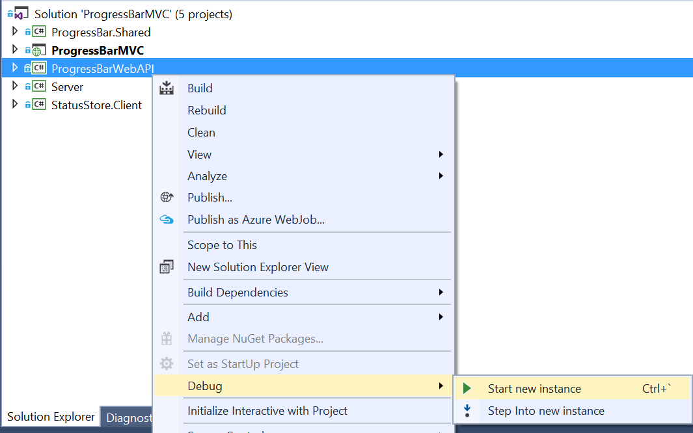

# ProgressBar.NServiceBus

An example of a progress bar implementation for [my blog](http://scionsoftware.com/Blog/progress-bars-arent-all-liars/).

### To view the demo, start debug instances of the following projects respectively:

**ProgressBarWebAPI** -> **Server** -> **ProgressBarMVC**
 
 ProgressBarMVC will allow you to trigger some "tasks" and view their progress.
 
### How to start a debug instance
 
 
